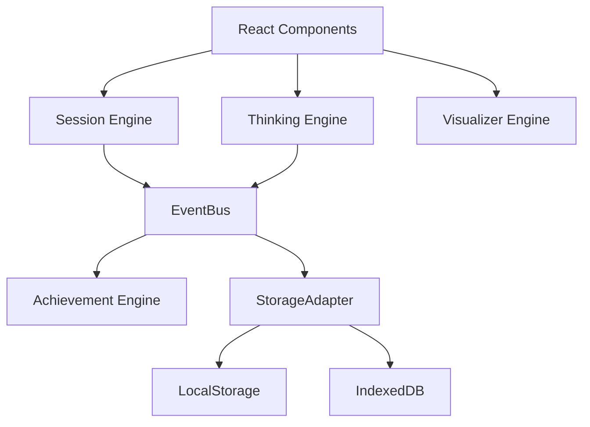

# System Architecture

DSA CRACKER is designed as an Engine-Driven, Event-Driven application.

## Core Principles
1. **Data-driven**: No hardcoded learning logic in UI components.
2. **Engine-driven**: Business logic lives in `src/engines/`.
3. **Event-driven**: Cross-engine communication happens via `src/core/events/`.

## High-Level Diagram

## Storage Adapter Pattern
To easily swap persistence layers in the future, we rely on a `StorageAdapter` interface (`src/core/storage/`). No part of the app calls `window.localStorage` directly.
