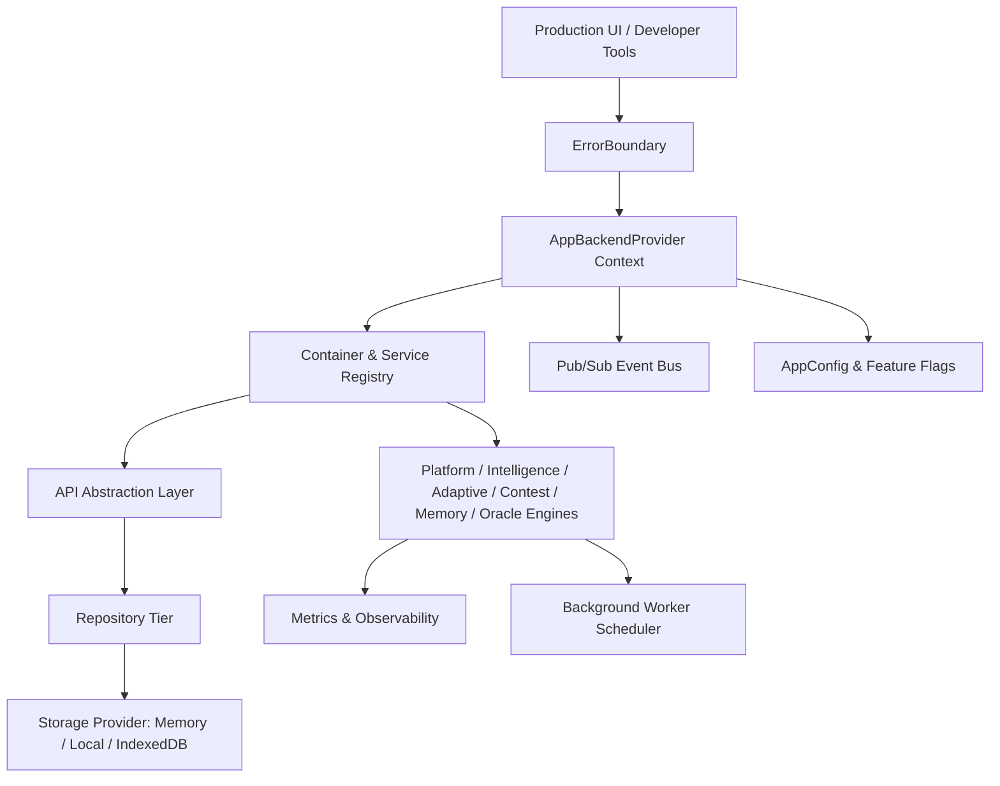

# Architecture Diagram

```mermaid
graph TD
    UI[Production UI / Developer Tools] --> EB[ErrorBoundary]
    EB --> Context[AppBackendProvider Context]
    Context --> IoC[Container & Service Registry]
    Context --> EventBus[Pub/Sub Event Bus]
    Context --> Config[AppConfig & Feature Flags]
    IoC --> API[API Abstraction Layer]
    API --> Repos[Repository Tier]
    Repos --> Storage[Storage Provider: Memory / Local / IndexedDB]
    IoC --> Engines[Platform / Intelligence / Adaptive / Contest / Memory / Oracle Engines]
    Engines --> Metrics[Metrics & Observability]
    Engines --> Workers[Background Worker Scheduler]
```
