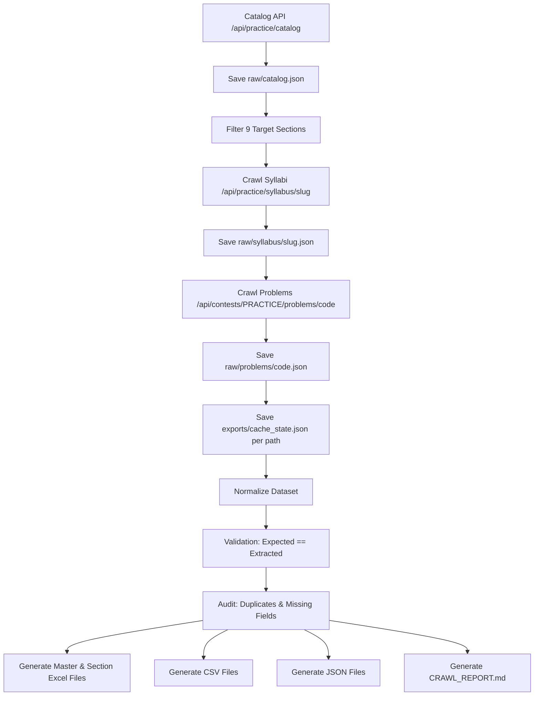

# Updated Architecture — CodeChef Practice Data Extraction Engine

A production-grade, modular, API-driven data extraction engine for CodeChef Practice platform. This engine downloads raw JSON responses for offline archival, normalizes data, validates problem counts, deduplicates records, and exports structured datasets into Excel, CSV, JSON, and comprehensive reports.

## Project Structure

```text
codechef-data-engine/
├── exports/
│   ├── codechef_practice_complete.xlsx
│   ├── codechef_practice_complete.csv
│   ├── codechef_practice_complete.json
│   ├── duplicate_report.csv
│   ├── missing_report.csv
│   ├── crawl_report.md
│   ├── cache_state.json
│   └── sections/
│       ├── beginner_dsa.xlsx
│       ├── data_structures.xlsx
│       ├── algorithms.xlsx
│       ├── difficulty_rating.xlsx
│       ├── star_paths.xlsx
│       ├── interview_questions.xlsx
│       ├── other_paths.xlsx
│       ├── company_questions.xlsx
│       └── advanced_challenges.xlsx
├── raw/
│   ├── catalog.json
│   ├── syllabus/
│   ├── problems/
│   └── api_logs/
├── scripts/
│   ├── crawl_catalog.py
│   ├── crawl_syllabus.py
│   ├── crawl_problem_details.py
│   ├── validate.py
│   ├── export_excel.py
│   ├── export_csv.py
│   ├── export_json.py
│   ├── audit.py
│   └── resume.py
├── config.py
├── implementation_plan.md
└── README.md
```

## Pipeline Architecture



## Modular Scripts Specification

1. **`config.py`**: Configuration constants, target section names, directory paths, rate limits, headers, retry policy.
2. **`scripts/crawl_catalog.py`**: Fetches `/api/practice/catalog`, saves `raw/catalog.json`, parses out target 9 sections and practice path slugs.
3. **`scripts/crawl_syllabus.py`**: Iterates through practice path slugs, fetches `/api/practice/syllabus/{slug}`, saves raw JSON into `raw/syllabus/{slug}.json`, updates `exports/cache_state.json`.
4. **`scripts/crawl_problem_details.py`**: Fetches `/api/contests/PRACTICE/problems/{code}` for all problem codes, saves raw JSON into `raw/problems/{code}.json`, caches result.
5. **`scripts/validate.py`**: Validates problem counts for every practice path (`Expected == Extracted`, `Difference = 0`).
6. **`scripts/audit.py`**: Audits duplicate URLs, duplicate codes, duplicate names/rows, and missing metadata. Generates `duplicate_report.csv` and `missing_report.csv`.
7. **`scripts/export_excel.py`**: Builds styled `exports/codechef_practice_complete.xlsx` (with `INDEX`, `SUMMARY`, and 9 Section worksheets) and 9 section `.xlsx` files in `exports/sections/`.
8. **`scripts/export_csv.py`**: Generates `exports/codechef_practice_complete.csv`.
9. **`scripts/export_json.py`**: Generates `exports/codechef_practice_complete.json`.
10. **`scripts/resume.py`**: Pipeline manager that orchestrates the entire process, checks for existing cache/exports, and resumes execution cleanly.

## Target 9 Sections
1. Beginner DSA
2. Data Structures
3. Algorithms
4. Difficulty Rating Wise
5. Star Wise Paths
6. Interview Questions
7. Other Practice Paths
8. Company Based Questions
9. Advanced Coding Challenges

---

## Verification Plan

### Automated Verification
1. Run full pipeline via `python scripts/resume.py` or modular scripts.
2. Ensure 100% of raw files are archived in `raw/syllabus/` and `raw/problems/`.
3. Check `exports/cache_state.json` shows 100% completion.
4. Verify presence and validity of:
   - `exports/codechef_practice_complete.xlsx`
   - `exports/sections/*.xlsx` (all 9 section workbooks)
   - `exports/codechef_practice_complete.csv`
   - `exports/codechef_practice_complete.json`
   - `exports/duplicate_report.csv`
   - `exports/missing_report.csv`
   - `CRAWL_REPORT.md` (and `exports/crawl_report.md`)
5. Validate `Difference = 0` for all practice paths across all 9 sections.
